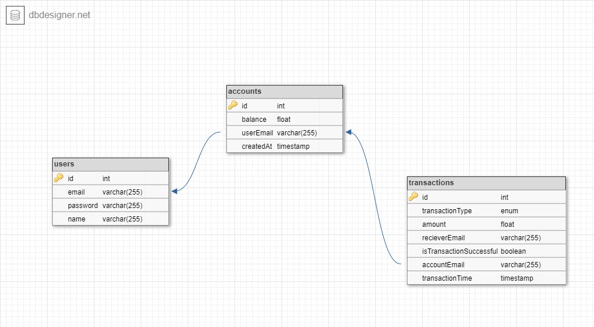

## Description

Demo Credit is a mobile lending app with account or wallet functionality. This enables borrowers to receive the loans they have been granted and also send the money for repayments.

## Requirements

- [Nodejs](https://nodejs.org/en/) is a JavaScript runtime built on Chrome's V8 JavaScript engine.
- [Mysql](https://www.mongodb.com/try/download/community) is a document-oriented NoSQL database used for high volume data storage. Instead of using tables and rows as in the traditional relational databases, MongoDB makes use of collections and documents. Documents consist of key-value pairs which are the basic unit of data in MongoDB. Collections contain sets of documents and function which is the equivalent of relational database tables.
- [Git](https://git-scm.com/) is a free and open source distributed version control system designed to handle everything from small to very large projects with speed and efficiency.

## How to setup locally

- Ensure you have the requirements listed above installed locally
- Open your terminal and clone this repository using `git clone https://github.com/alahirajeffrey/demo-credit-wallet.git`.
- Navigate to project folder and install dependencies using `npm install`.
- Create .env file and add environment variables using .env.sample as a guide.
- Run the command `npx knex migrate:latest` to run the migration files and create the database tables.
- Type `npm run start:dev` to run server in development mode.
- Type `npm run start:prod` to start server in production mode.
- Open your broswer and type the url `http://localhost:3000/api-doc/` to navigate to the swagger documentation of the api

## API En dpoints

## User Workflow

- User creates an account
- User then logs into his account
- User can then fund his/her account with the desired amount
- User can also transfer funds to other accounts as well as withdraw funds from his/her account.

## Database Design

## Link to Deployed app

### Developers

[Alahira Jeffrey](https://github.com/alahirajeffrey)

## License

Nest is [MIT licensed](LICENSE)
